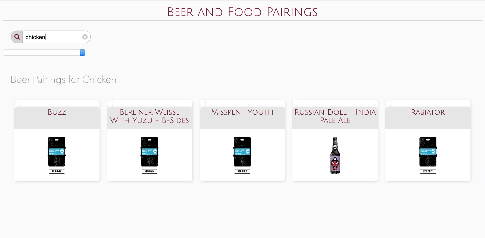

# Weekend Homework: Pub/Sub Application with Requests

### Learning Objectives

- Be able to create a web application with a modular front-end
- Be able to implement reusable and nested views
- Be able to make API requests to load JSON data into your application

## Brief

Create an application that makes a request to an API and displays the data.

Chosen API: Brewdog Beer: `https://punkapi.com/`

- The application displays all the Brewdog Beers and allows the user to choose a food pairing to view only the beers that go well with the inputted food item.

## Getting Started

These instructions will get you a copy of the project up and running on your local machine for development purposes.

### Installing

Install dependencies:

```
npm install
```

Run webpack:

```
npm i -D webpack webpack-cli
```
Now run npm run build - this will build the bundle.js file as specified in webconfig.js


```
npm run build
```

### Using

In atom, right click on index.html and choose 'open in browser', the website will now be visible.

#### Screenshot of Beer API website




